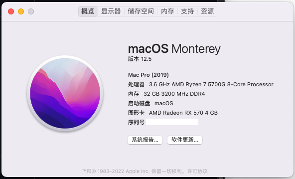

# b450m-5700g-hackintosh
EFI config for AMD Ryzen 5700G + B450M Mortar Max motherboard

## WARNING - THIS CONFIG CANNOT BE USED AS-IS EVEN YOU HAVE THE SAME HARDWARE CONFIGURATION. 

You need to change some value under `PlatformInfo -> Generic` using GenSMBios
- MLB
- ROM
- SystemSerialNumber
- SystemUUID

If you don't know how, [RTFM](https://dortania.github.io/OpenCore-Post-Install/universal/iservices.html#making-en0-show-as-built-in)

# Mods done
- USB mapping (front panel usb ports not tested)
- OpenCanopy GUI
- Boot chime
- All kexts/drivers using release version

# Hardware config
- MSI B450M Mortar Max
  - USB mapping is specific to motherboard model so beware that it's highly possible my mapping can be different from yours in case you don't have the same motherboard
  - Onboard Audio Codec: alc892
  - Onboard Ethernet: rtl8111
- AMD Ryzen 5700G
  - Onboard HDMI port outputs but it uses VESA driver as there's no support for iGPU in APUs
  - theoritically any Ryzen 8-core CPUs would work
- Intel Wireless AC-7260
  - Driven using Airportitlwm.kext
- 4x8Gib Dual Channel DDR4 @ 3200 MHZ
  - This does not affect the config, just came to show off (wat
- XFX RX 570 4GiB

# What's working
Almost everything

# Issues
- Not tested, but doesn't seem to have one
- Optane NVMe disks seem does not like NVmeFix.kext
- Booting on NVMe disks are not tested
